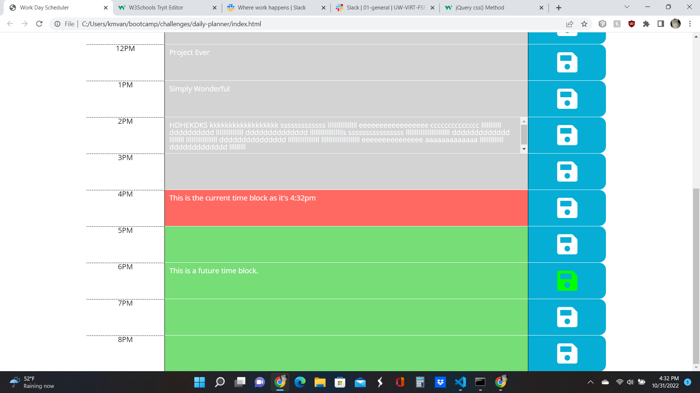

# daily-planner
## Description

This program creates a day planner to use to plan your current day. 

- Used Moment.JS to do time calculations
- created a load function to initialize the planner
- created an eventlistener to save timeblocks to local storage
- created a function to clear the storage on day changes
- Wrote and commented the Javascript code
- Created a read.me

## Screenshot

.png)

.png)

## Link to Project

[https://vanwykkim.github.io/daily-planner/]

## Credits

UW bootcamp provided initial index.html and style.css for the project

## License

Please refer to the LICENSE in the repo.